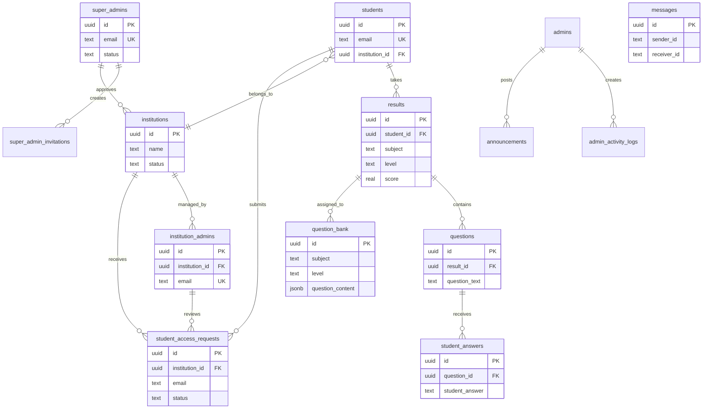

# Astro Admit Flow - Database Schema

Complete database schema documentation for the Supabase PostgreSQL database.

---

## Table of Contents

1. [Core Tables](#core-tables)
   - [students](#students)
   - [results](#results)
   - [questions](#questions)
   - [student_answers](#student_answers)
2. [Question Bank & Vector Store](#question-bank--vector-store)
   - [question_bank](#question_bank)
   - [documents](#documents)
   - [topics](#topics)
3. [Exam Management](#exam-management)
   - [exam_locks](#exam_locks)
4. [Institution Management](#institution-management)
   - [institutions](#institutions)
   - [super_admins](#super_admins)
   - [institution_admins](#institution_admins)
   - [student_access_requests](#student_access_requests)
   - [super_admin_invitations](#super_admin_invitations)
5. [Admin & Messaging](#admin--messaging)
   - [admins](#admins)
   - [admin_settings](#admin_settings)
   - [admin_activity_logs](#admin_activity_logs)
   - [announcements](#announcements)
   - [messages](#messages)
6. [Views](#views)
   - [question_analytics](#question_analytics)
7. [Entity Relationship Diagram](#entity-relationship-diagram)

---

## Core Tables

### students

Primary table for student registration and profile management.

| Column | Type | Constraints | Default | Description |
|--------|------|-------------|---------|-------------|
| `id` | UUID | PRIMARY KEY | `gen_random_uuid()` | Unique identifier |
| `first_name` | TEXT | NOT NULL | - | Student's first name |
| `last_name` | TEXT | NOT NULL | - | Student's last name |
| `age` | INTEGER | NOT NULL | - | Student's age |
| `dob` | DATE | NOT NULL | - | Date of birth |
| `email` | TEXT | NOT NULL, UNIQUE | - | Email address |
| `phone` | TEXT | NOT NULL | - | Phone number |
| `concession` | INTEGER | - | `0` | Fee concession percentage |
| `role` | TEXT | - | `'student'` | User role |
| `institution_id` | UUID | FK → institutions(id) | - | Associated institution |
| `access_request_id` | UUID | - | - | Related access request |
| `logout_time` | TIMESTAMPTZ | - | - | Last logout timestamp |
| `last_active_at` | TIMESTAMPTZ | - | `NOW()` | Last activity timestamp |
| `created_at` | TIMESTAMPTZ | - | `NOW()` | Record creation time |
| `updated_at` | TIMESTAMPTZ | - | `NOW()` | Last update time |

**Indexes:**
- `idx_students_institution` on `(institution_id)`

**Triggers:**
- `update_students_updated_at` - Updates `updated_at` on record modification

---

### results

Stores exam/test results for students across different subjects and difficulty levels.

| Column | Type | Constraints | Default | Description |
|--------|------|-------------|---------|-------------|
| `id` | UUID | PRIMARY KEY | `gen_random_uuid()` | Unique identifier |
| `student_id` | UUID | NOT NULL, FK → students(id) ON DELETE CASCADE | - | Associated student |
| `subject` | TEXT | - | `'physics'` | Subject (physics/math/chemistry) |
| `level` | TEXT | NOT NULL, CHECK (IN easy/medium/hard) | - | Difficulty level |
| `score` | REAL | - | - | Test score |
| `result` | TEXT | CHECK (IN pass/fail/pending) | - | Test result |
| `attempts_easy` | INTEGER | - | `0` | Easy level attempts |
| `attempts_medium` | INTEGER | - | `0` | Medium level attempts |
| `attempts_hard` | INTEGER | - | `0` | Hard level attempts |
| `created_at` | TIMESTAMPTZ | - | `NOW()` | Record creation time |
| `updated_at` | TIMESTAMPTZ | - | `NOW()` | Last update time |

**Triggers:**
- `update_results_updated_at` - Updates `updated_at` on record modification

---

### questions

Stores exam questions linked to specific test results.

| Column | Type | Constraints | Default | Description |
|--------|------|-------------|---------|-------------|
| `id` | UUID | PRIMARY KEY | `gen_random_uuid()` | Unique identifier |
| `result_id` | UUID | NOT NULL, FK → results(id) ON DELETE CASCADE | - | Associated result/test |
| `question_text` | TEXT | NOT NULL | - | Question content |
| `correct_answer` | TEXT | NOT NULL | - | Expected correct answer |
| `created_at` | TIMESTAMPTZ | - | `NOW()` | Record creation time |

---

### student_answers

Stores student responses to exam questions.

| Column | Type | Constraints | Default | Description |
|--------|------|-------------|---------|-------------|
| `id` | UUID | PRIMARY KEY | `gen_random_uuid()` | Unique identifier |
| `question_id` | UUID | NOT NULL, FK → questions(id) ON DELETE CASCADE | - | Associated question |
| `student_answer` | TEXT | NOT NULL | - | Student's submitted answer |
| `created_at` | TIMESTAMPTZ | - | `NOW()` | Record creation time |

---

## Question Bank & Vector Store

### question_bank

Pre-generated questions pool for exams.

| Column | Type | Constraints | Default | Description |
|--------|------|-------------|---------|-------------|
| `id` | UUID | PRIMARY KEY | `uuid_generate_v4()` | Unique identifier |
| `subject` | TEXT | NOT NULL | - | Subject (physics/math/chemistry) |
| `level` | TEXT | NOT NULL, CHECK (IN easy/medium/hard) | - | Difficulty level |
| `question_content` | JSONB | NOT NULL | - | Question JSON: `{question, answer, context}` |
| `is_used` | BOOLEAN | - | `FALSE` | Whether question has been assigned |
| `assigned_result_id` | UUID | FK → results(id) | - | Assigned test result |
| `created_at` | TIMESTAMPTZ | - | `NOW()` | Record creation time |
| `used_at` | TIMESTAMPTZ | - | - | When question was assigned |

**Indexes:**
- `idx_question_bank_fetch` on `(subject, level, is_used)`

---

### documents

Vector store for RAG (Retrieval Augmented Generation) - stores embedded document content.

| Column | Type | Constraints | Default | Description |
|--------|------|-------------|---------|-------------|
| `id` | UUID | PRIMARY KEY | `uuid_generate_v4()` | Unique identifier |
| `content` | TEXT | - | - | Document text content |
| `metadata` | JSONB | - | - | Document metadata |
| `embedding` | VECTOR(768) | - | - | Gemini embedding vector |

**Functions:**
- `match_documents(query_embedding, match_threshold, match_count, filter)` - Similarity search

---

### topics

Stores extracted topics from PDFs for question generation.

| Column | Type | Constraints | Default | Description |
|--------|------|-------------|---------|-------------|
| `id` | UUID | PRIMARY KEY | `uuid_generate_v4()` | Unique identifier |
| `subject` | TEXT | NOT NULL | - | Subject area |
| `topic_name` | TEXT | NOT NULL | - | Topic name |
| `difficulty_hint` | JSONB | - | - | Optional difficulty metadata |
| `pdf_hash` | TEXT | NOT NULL | - | Source PDF hash for versioning |
| `created_at` | TIMESTAMPTZ | - | `NOW()` | Record creation time |

**Constraints:**
- UNIQUE on `(subject, topic_name, pdf_hash)`

**Indexes:**
- `idx_topics_subject_hash` on `(subject, pdf_hash)`

---

## Exam Management

### exam_locks

Ensures deterministic question assignment per student exam session.

| Column | Type | Constraints | Default | Description |
|--------|------|-------------|---------|-------------|
| `id` | UUID | PRIMARY KEY | `uuid_generate_v4()` | Unique identifier |
| `student_id` | UUID | FK → students(id) | - | Associated student |
| `subject` | TEXT | NOT NULL | - | Exam subject |
| `level` | TEXT | NOT NULL | - | Difficulty level |
| `question_ids` | JSONB | NOT NULL | - | Array of assigned question IDs |
| `status` | TEXT | - | `'active'` | Lock status (active/completed) |
| `created_at` | TIMESTAMPTZ | - | `NOW()` | Record creation time |
| `updated_at` | TIMESTAMPTZ | - | `NOW()` | Last update time |

**Indexes:**
- `idx_exam_locks_student_active` on `(student_id, subject, level)` WHERE status = 'active'

---

## Institution Management

### institutions

Registered educational institutions.

| Column | Type | Constraints | Default | Description |
|--------|------|-------------|---------|-------------|
| `id` | UUID | PRIMARY KEY | `gen_random_uuid()` | Unique identifier |
| `name` | TEXT | NOT NULL | - | Institution name |
| `type` | TEXT | CHECK (IN school/college/coaching) | - | Institution type |
| `website` | TEXT | - | - | Institution website |
| `affiliation_number` | TEXT | - | - | Official affiliation number |
| `country` | TEXT | - | `'India'` | Country |
| `state` | TEXT | - | - | State/Province |
| `status` | TEXT | NOT NULL, CHECK (IN pending/approved/rejected/suspended) | `'pending'` | Approval status |
| `documents_url` | TEXT | - | - | Supporting documents URL |
| `rejection_reason` | TEXT | - | - | Reason if rejected |
| `approved_by` | UUID | - | - | Super admin who approved |
| `created_at` | TIMESTAMPTZ | - | `NOW()` | Record creation time |
| `approved_at` | TIMESTAMPTZ | - | - | Approval timestamp |

**Indexes:**
- `idx_institutions_status` on `(status)`

---

### super_admins

Platform-level administrators.

| Column | Type | Constraints | Default | Description |
|--------|------|-------------|---------|-------------|
| `id` | UUID | PRIMARY KEY | `gen_random_uuid()` | Unique identifier |
| `email` | TEXT | UNIQUE, NOT NULL | - | Admin email |
| `name` | TEXT | - | - | Admin name |
| `status` | TEXT | CHECK (IN pending/active/suspended) | `'pending'` | Account status |
| `invited_by` | UUID | FK → super_admins(id) | - | Inviting admin |
| `magic_link_token` | TEXT | - | - | Activation token |
| `magic_link_expires` | TIMESTAMPTZ | - | - | Token expiry |
| `activated_at` | TIMESTAMPTZ | - | - | Activation timestamp |
| `created_at` | TIMESTAMPTZ | - | `NOW()` | Record creation time |

**Indexes:**
- `idx_super_admin_status` on `(status)`
- `idx_super_admin_magic_token` on `(magic_link_token)`

---

### institution_admins

Administrators for individual institutions.

| Column | Type | Constraints | Default | Description |
|--------|------|-------------|---------|-------------|
| `id` | UUID | PRIMARY KEY | `gen_random_uuid()` | Unique identifier |
| `institution_id` | UUID | FK → institutions(id) ON DELETE CASCADE | - | Associated institution |
| `email` | TEXT | UNIQUE, NOT NULL | - | Admin email |
| `name` | TEXT | - | - | Admin name |
| `phone` | TEXT | - | - | Phone number |
| `designation` | TEXT | - | - | Job title/designation |
| `status` | TEXT | NOT NULL, CHECK (IN pending/active/suspended) | `'pending'` | Account status |
| `magic_link_token` | TEXT | - | - | Activation token |
| `magic_link_expires` | TIMESTAMPTZ | - | - | Token expiry |
| `activated_at` | TIMESTAMPTZ | - | - | Activation timestamp |
| `created_at` | TIMESTAMPTZ | - | `NOW()` | Record creation time |

**Indexes:**
- `idx_institution_admins_email` on `(email)`
- `idx_institution_admins_institution` on `(institution_id)`

---

### student_access_requests

Student applications for institution access.

| Column | Type | Constraints | Default | Description |
|--------|------|-------------|---------|-------------|
| `id` | UUID | PRIMARY KEY | `gen_random_uuid()` | Unique identifier |
| `institution_id` | UUID | FK → institutions(id) ON DELETE CASCADE | - | Target institution |
| `name` | TEXT | NOT NULL | - | Applicant name |
| `email` | TEXT | NOT NULL | - | Applicant email |
| `phone` | TEXT | - | - | Phone number |
| `stream_applied` | TEXT | - | - | Applied stream/course |
| `scorecard_url` | TEXT | NOT NULL | - | Scorecard document URL |
| `status` | TEXT | NOT NULL, CHECK (IN pending/approved/rejected) | `'pending'` | Request status |
| `reviewed_by` | UUID | FK → institution_admins(id) | - | Reviewing admin |
| `rejection_reason` | TEXT | - | - | Reason if rejected |
| `magic_link_token` | TEXT | - | - | Access token |
| `magic_link_expires` | TIMESTAMPTZ | - | - | Token expiry |
| `last_document_upload_at` | TIMESTAMPTZ | - | `NOW()` | Last document update |
| `reviewed_at` | TIMESTAMPTZ | - | - | Review timestamp |
| `created_at` | TIMESTAMPTZ | - | `NOW()` | Record creation time |

**Constraints:**
- UNIQUE on `(email, institution_id, status)` NULLS NOT DISTINCT

**Indexes:**
- `idx_student_access_requests_email` on `(email)`
- `idx_student_access_requests_institution` on `(institution_id)`
- `idx_student_access_requests_status` on `(status)`

---

### super_admin_invitations

Audit trail for super admin invitations.

| Column | Type | Constraints | Default | Description |
|--------|------|-------------|---------|-------------|
| `id` | UUID | PRIMARY KEY | `gen_random_uuid()` | Unique identifier |
| `email` | TEXT | NOT NULL | - | Invitee email |
| `name` | TEXT | NOT NULL | - | Invitee name |
| `invited_by` | UUID | NOT NULL, FK → super_admins(id) | - | Inviting admin |
| `magic_link_token` | TEXT | NOT NULL | - | Invitation token |
| `magic_link_expires` | TIMESTAMPTZ | NOT NULL | - | Token expiry |
| `status` | TEXT | CHECK (IN pending/accepted/expired/revoked) | `'pending'` | Invitation status |
| `accepted_at` | TIMESTAMPTZ | - | - | Acceptance timestamp |
| `created_at` | TIMESTAMPTZ | - | `NOW()` | Record creation time |

**Indexes:**
- `idx_super_admin_invitations_email` on `(email)`
- `idx_super_admin_invitations_token` on `(magic_link_token)`

---

## Admin & Messaging

### admins

Legacy admin table (Firebase auth linked).

| Column | Type | Constraints | Default | Description |
|--------|------|-------------|---------|-------------|
| `id` | UUID | PRIMARY KEY | `gen_random_uuid()` | Unique identifier |
| `firebase_uid` | TEXT | UNIQUE, NOT NULL | - | Firebase user ID |
| `email` | TEXT | UNIQUE, NOT NULL | - | Admin email |
| `first_name` | TEXT | NOT NULL | - | First name |
| `last_name` | TEXT | NOT NULL | - | Last name |
| `role` | TEXT | - | `'admin'` | Admin role |
| `created_at` | TIMESTAMPTZ | - | `NOW()` | Record creation time |

---

### admin_settings

Key-value store for application settings.

| Column | Type | Constraints | Default | Description |
|--------|------|-------------|---------|-------------|
| `key` | TEXT | PRIMARY KEY | - | Setting key |
| `value` | TEXT | NOT NULL | - | Setting value (JSON string) |
| `updated_at` | TIMESTAMPTZ | - | `NOW()` | Last update time |

**Default Values:**
- `allowed_admin_domains`: `["admin.com", "institution.edu"]`

---

### admin_activity_logs

Audit log for admin actions.

| Column | Type | Constraints | Default | Description |
|--------|------|-------------|---------|-------------|
| `id` | UUID | PRIMARY KEY | `gen_random_uuid()` | Unique identifier |
| `admin_id` | UUID | FK → admins(id) | - | Acting admin |
| `admin_name` | TEXT | - | - | Admin name (denormalized) |
| `action_type` | TEXT | NOT NULL | - | Action type (settings_update, etc.) |
| `details` | JSONB | - | - | Action details |
| `created_at` | TIMESTAMPTZ | - | `NOW()` | Record creation time |

---

### announcements

System-wide announcements for users.

| Column | Type | Constraints | Default | Description |
|--------|------|-------------|---------|-------------|
| `id` | UUID | PRIMARY KEY | `gen_random_uuid()` | Unique identifier |
| `title` | TEXT | NOT NULL | - | Announcement title |
| `content` | TEXT | NOT NULL | - | Announcement body |
| `target_audience` | TEXT | NOT NULL | - | Target: all/students/teachers |
| `created_by` | UUID | FK → students(id) | - | Creator reference |
| `created_at` | TIMESTAMPTZ | - | `NOW()` | Record creation time |

---

### messages

Chat messages between users.

| Column | Type | Constraints | Default | Description |
|--------|------|-------------|---------|-------------|
| `id` | UUID | PRIMARY KEY | `gen_random_uuid()` | Unique identifier |
| `sender_id` | TEXT | NOT NULL | - | Sender ID |
| `sender_type` | TEXT | NOT NULL, CHECK (IN student/admin) | - | Sender role type |
| `receiver_id` | TEXT | NOT NULL | - | Receiver ID |
| `receiver_type` | TEXT | NOT NULL, CHECK (IN student/admin) | - | Receiver role type |
| `content` | TEXT | NOT NULL | - | Message content |
| `is_read` | BOOLEAN | - | `FALSE` | Read status |
| `created_at` | TIMESTAMPTZ | - | `NOW()` | Record creation time |

**Indexes:**
- `idx_messages_sender` on `(sender_id)`
- `idx_messages_receiver` on `(receiver_id)`

---

## Views

### question_analytics

Aggregated analytics for question performance.

```sql
SELECT 
    q.id AS question_id,
    q.question_text,
    q.result_id,
    COUNT(sa.id) AS attempt_count,
    COUNT(CASE WHEN sa.student_answer = q.correct_answer THEN 1 END) AS correct_count,
    AVG(CASE WHEN sa.student_answer = q.correct_answer THEN 1 ELSE 0 END) * 100 AS correct_percentage
FROM questions q
LEFT JOIN student_answers sa ON q.id = sa.question_id
GROUP BY q.id, q.question_text, q.result_id;
```

---

## Entity Relationship Diagram



---

## PostgreSQL Extensions

| Extension | Purpose |
|-----------|---------|
| `uuid-ossp` | UUID generation functions |
| `vector` | Vector similarity search for RAG |

---

## Row Level Security (RLS)

All tables have RLS enabled with policies for:
- **Super admins**: Full access to most tables
- **Institution admins**: Access to their institution's data only
- **Students**: Access to their own data only

---

*Document generated on: 2026-01-08*
