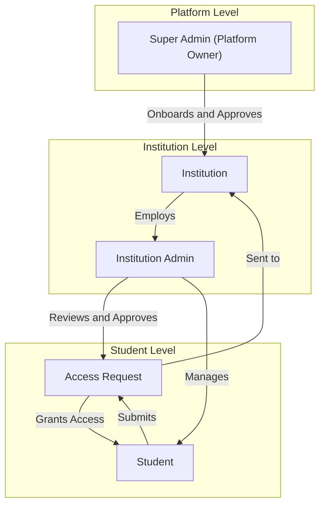
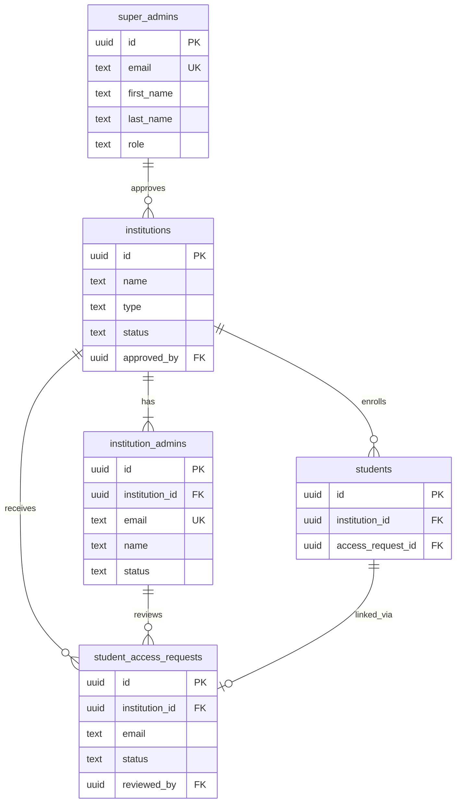

# Entity Relationship Diagram

This document illustrates the relationships between Platform Admins, Institutional Admins, and Students.

## Access Control Hierarchy

## Database Entity Relationships

## Key Relationships Summary

| From | To | Relationship |
|------|-----|--------------|
| Super Admin | Institution | Approves and onboards institutions |
| Institution | Institution Admin | Has one or more admins |
| Institution | Student | Enrolls students |
| Student | Access Request | Submits request for access |
| Institution Admin | Access Request | Reviews and approves/rejects |
| Access Request | Student | Links student to institution |
